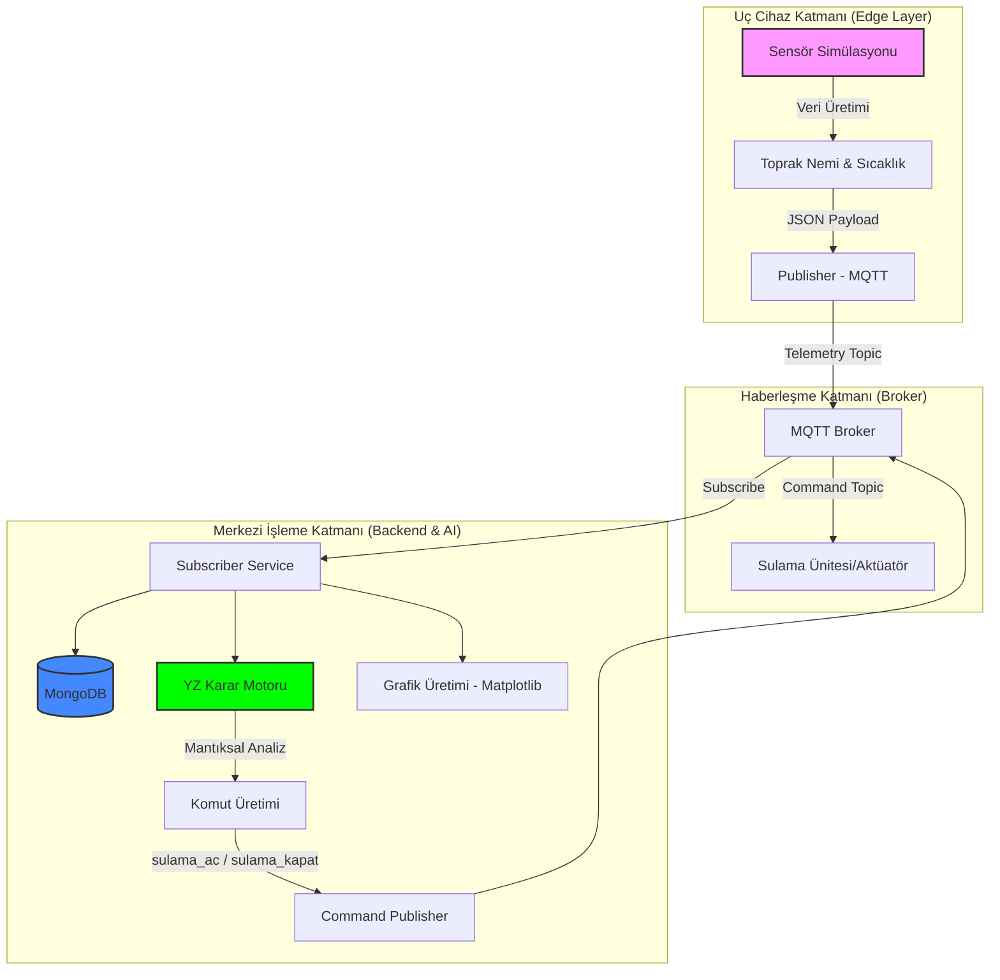

# IOT_simulation

PS > & "C:\Program Files\mosquitto\mosquitto.exe" -c "c:\Users\HP\Desktop\sil16\nesnelerin_interneti\IOT_simulation-main\IOT_simulation-main_v2\IOT_simulation\yerel_mosquitto.conf" -v

